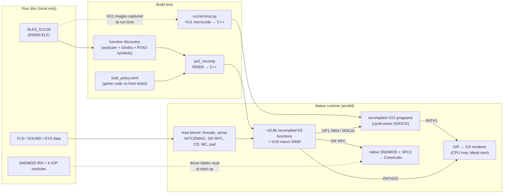

# Road Trip Adventure: a native PS2 static recompilation

<p align="center"></p>

**_Road Trip Adventure_** (PAL, SLES-51356; *Choro Q HG 2* in Japan, *Road Trip* in North America) **running natively on Apple Silicon**. The game's own MIPS code is **statically recompiled to C++**, as are its **VU1 vector microprograms**. Its IOP sound driver is **re-implemented natively**. No PS2 BIOS, no CPU emulator, no interpreter in the hot path. It's in the spirit of N64Recomp / Zelda64Recomp, but for the PS2's much stranger hardware.

> **No game code or data is in this repository.** You need your own disc. The tools read *your* image locally and generate everything on your machine.

  

<p align="center"></p>
<p align="center"><sub>All frames rendered by the native build (software GS, 512×512 PAL output, shown at 4:3).</sub></p>

---

## What works today
| | |
| --- | --- |
| **Boot** | Native arm64 with **no BIOS**. All 7 IOP modules are replaced by native services; **zero IRX code executes**. |
| **Adventure mode** | Name entry → opening cutscene → Q's Factory → free roam in **Peach Town**. |
| **Quick Race** | Course select with live 3D course previews → race with all **24 cars**, HUD, minimap, countdown and lap timer. |
| **Audio** | All music and SFX, through a native re-implementation of the game's sound driver on a software SPU2 → CoreAudio. |
| **Timing** | PAL 50 Hz frame pacing, no catch-up bursts. A **deterministic mode** produces byte-identical frames run after run. |
| **VU1** | 100% of microprogram calls run as **statically recompiled native code**: 0 interpreter fallbacks, bit-identical to the reference over 425k calls. |

**Known issues:**
- 3D runs at ~20–30 fps; the target is a locked 50. The bottleneck is the software GS rasteriser, and a faster one plus a Metal backend come next.
- The speedometer *digits* are stuck at "183" (the needle works).
- Saves, shops and full 3-lap races haven't been through automated testing yet.

---

## How it works: the deep dive



### 1. The Emotion Engine (R5900) → C++
- **Function discovery.** About 10,800 entry points come from three sources merged: PS2Recomp's analyzer (SDK signature matching: 230 library functions), Ghidra with the EE plugin (1,473 functions, 9,281 labels), and symbols harvested from [RTAO](https://github.com/je55pr/rtao)'s reverse engineering (1,010 exact entries). The analyzer also resolves 38 jump tables.
- **One C++ function per guest function.** Each is a big `switch(ctx->pc)` plus labels, so execution can re-enter mid-function after a call returns. Every instruction is preceded by its disassembly in a comment, which makes the generated code a debugger in its own right.
- **Dispatch.** `JAL`/`JALR`/`JR` go through a dense address → function-pointer table. Indirect jumps that can't be resolved statically fall back to a run-time lookup and are counted. That same table is how function **hooks** work: swap one slot.
- **Delay slots and branch-likely** nullification are emitted faithfully. All 128-bit GPRs, HI1/LO1 and SA are modelled, and **MMI** parallel ops are SIMD.
- **The FPU is not IEEE.** The R5900 FPU rounds toward zero, has no Inf/NaN/denormals, clamps to ±FLT_MAX, and computes `RSQRT.S` as `fs/sqrt(ft)` (not `1/sqrt`). The game thread runs with the host FPU in round-toward-zero + flush-to-zero, and the translator emits helpers for the operations where host and R5900 differ (DIV by zero, RSQRT, saturating CVT.W).
- **VU0 macro mode (COP2)** is translated inline to NEON (via sse2neon) **including the flag registers**:
  - MAC flags (Z/S/U/O per lane), status with sticky bits, the 24-bit clip history, and I/D for DIV/SQRT/RSQRT.
  - VF0 is write-protected. This matters: the game's floor clipper does `vsub.xyw vf0, a, b` *purely to set sign flags* and then reads `status & 0xC0`.
  - Semantics come from the Sony *VU User's Manual*, cross-checked against PCSX2's interpreter and microVU (see [`docs/VU0_MACRO_FLAGS_RESEARCH.md`](docs/VU0_MACRO_FLAGS_RESEARCH.md)).

### 2. VU1 microprograms → C++ (the fun part)
VU1 is a VLIW vector processor that runs every frame's transform and clipping. Interpreting it cost ~80% of frame time (9.5 fps). [`tools/vu1recomp/`](tools/vu1recomp/) is a **static recompiler for VU1 microcode**:
- **Programs are graphs of `(pc, pipeline-state)` nodes.** Every MSCAL starts with an empty pipeline, so the generator runs the VU's scheduler *abstractly at build time*. That covers FMAC/FDIV/EFU latencies and stalls, the 4-deep MAC/status/clip flag pipeline (FSSET/FCSET cancelling in-flight entries), the VI-register branch-backup quirk, and branch and E-bit delay slots. Every stall, flag commit and cycle-counter increment becomes a **compile-time constant**. The only data-dependent timing, an XGKICK queued behind another, becomes a small `switch` over the possible stall counts.
- **Bit-exact float.** Code is emitted with `vfmaq_f32`/`vfmsq_f32` exactly where the reference fuses multiply-add, and plain mul/add everywhere else (`-ffp-contract=off`). Operands are clamped only on lanes a forward dataflow pass can't prove normalized.
- **Flag liveness.** A backward pass deletes flag computations no `FM*`/`FS*`/`FC*` reader can observe (all 111 FMAC flag producers vanish for this game). A *full* variant keeps them all, so the flag model itself can be proven exact.
- **Cycle-exact PATH1.** XGKICK copies are lazily but exactly modelled (qword *k* at issue+1+2k), because the game overwrites a buffer *while it's still being sent*.
- **Dispatch tables.** The game's VU1 image starts with an 8-slot `B` jump table. The generator detects it and compiles every slot, not just the ones a capture run happened to see.
- **Verification.** `PS2X_VU1_DIFF=1` runs native and interpreter side by side and compares GIF bytes, all VF/VI/ACC/Q/P/I/R, flags, all 16 KiB of data memory and the cycle count: **425,727 calls, 0 mismatches.** Offline replay adds 538 snapshots plus 22k fuzzed runs (denormals, ±0, Inf/NaN, huge/tiny), also 0 mismatches.
- **Result:** VU1 drops from ~82 ms to ~1.3 ms per frame.

### 3. The IOP, with no IOP
The PS2's I/O processor runs `.IRX` modules (MIPS R3000 code). Here **none of it executes**:
- **SNDMOD** (the game's Tamsoft-style sequencer/sound driver) was reverse-engineered with Ghidra (it ships with symbols and stabs) and **re-implemented in C++**: the RPC protocol, sequencer, voice allocation, engine and radio streaming. It runs on a software **SPU2**: 48 voices, PS-ADPCM, ADSR envelopes, volume sweeps, core mixing. The driver's parameter tables are **read from your `SNDMOD.IRX` at start-up**, so no disc data lives in the source. Driver ticks are clocked by the audio render clock, so music tempo can't drift from audio output.
- **PADMAN / MCMAN / MCSERV / SIO2MAN / LIBSD / SDRDRV** are claimed by native services. Memory-card saves go to a folder on your Mac.

### 4. Graphics
- The game's own **libgraph** code runs: double-buffering, display/draw environments. The PS2Recomp HLE replacements put buffer 2 *on top of the Z-buffer*, which caused full-screen flicker.
- GIF PATH1 (VU1), PATH2 (VIF1 DIRECT) and PATH3 (EE DMA) feed a GS model with swizzled VRAM, CLUT/TEXA, alpha/fog/depth, and field-mode (`SMODE2.FFMD`) scan-out.
- Today the rasteriser is a **CPU reference backend**. It is the oracle for a Metal backend, which will bring resolution scaling, widescreen and high-frame-rate interpolation.

### 5. "Run the game's own code": the bug hunt behind it
PS2Recomp can swap well-known SDK library functions for hand-written native "HLE" versions. That's fast and convenient, but several of these were subtly wrong:

| Symptom | Root cause | Fix |
| --- | --- | --- |
| Whole-screen flicker | HLE `sceGsSetDefDBuffDc` & co. placed frame buffer 2 over the Z-buffer | Run the game's own libgraph |
| **Races: HUD only, no 3D at all** | HLE `sceVu0MulMatrix` multiplied **A×B where the game computes B×A**. The race camera matrix came out as rows `[axis, axis, translation, axis]`, so every vertex's *z* was multiplied by ~570 and landed 1,000 px off-screen. | Run the game's own libvu0 (29 routines) |
| Black wedge on interior floors | The floor clipper relies on VU0 **macro-mode sign flags** and a write to VF0. Neither was modelled. | VU0 MAC/status/clip flags + VF0 write-protect in the translator |
| Missing car models, empty course previews, a hang entering free roam | Same two causes. The hang came from a NULL packet pointer sent as a DMA chain. | Same fixes |
| 1-ulp trig differences | Host `sinf`/`cosf` instead of the game's own kernels | Run the game's libm float kernels |

The race bug was found by working backwards:
1. 83k PATH1 vertices arrived but only 78 triangles were drawn.
2. The raw VU1 output coordinates were already off-screen.
3. The VU1 data memory showed the model-view rows in the wrong order.
4. The EE RAM had the same layout.
5. A full-state snapshot pinned it to one call: the chase-camera controller.
6. An independent R5900/VU0 oracle re-executed that call, once with the game's real libvu0 and once with the HLE model. The HLE model reproduced our bad output to 1e-7. The game's code put the camera eye right next to the player car.

[`config/stub_policy.toml`](config/stub_policy.toml) now pins **46 functions to run as game code**, so a regenerated config can never quietly bring the bad stubs back.

### 6. Testing a game you can't see (the agent that built this had no screen)
- **Scripted input keyed on the pad-read count.** That's the game's own frame clock, so scripts replay identically in real-time *and* deterministic mode.
- **`PS2X_DETERMINISTIC=1`**: all events run on EE cycle counts, giving byte-identical frames across runs *and builds*. A renderer optimisation is accepted only if [`tests/compare_frames.py`](tests/compare_frames.py) says the frames are identical.
- **Routes** ([`tests/run_route.py`](tests/run_route.py)) play scripted sequences headless and check each one:
  - checkpoints are non-black and not "flat" (a mostly-one-colour frame means missing geometry);
  - no flicker;
  - fps thresholds are met;
  - **zero VU1 fallbacks** and no uncatalogued microcode;
  - no missing functions, unexpected RPCs or crashes.
- **`PS2X_TRACE_CALLS`** hooks any recompiled function. It logs arguments and returns, dumps memory, or writes a **full RAM + register snapshot** at entry and exit.
- [`tests/oracle/`](tests/oracle/) holds an **independent R5900 + VU0-macro executor** that replays one snapshotted call and diffs it against the native build: per-call conformance testing of a recompiler. It can run the game's real code or a model of our host stubs at each stubbed call.

---

## Targets and roadmap
- **Now:** macOS on Apple Silicon.
- **Next:**
  - a locked 50 fps (faster software GS, then **Metal**);
  - an in-app settings menu with internal resolution 1×–8×, 16:9/21:9 widescreen with a 4:3-anchored HUD, **high frame rate via renderer-side interpolation** (game logic stays at 50 Hz), MSAA/filtering, controller remapping and rumble, volume sliders, and fast loading;
  - a **mod loader** (asset-override folder plus named C function hooks);
  - a signed `.app` with a first-run "select your disc" flow.
- **Then:** Windows (D3D12/Vulkan), Linux / Steam Deck, the browser (WebAssembly + WebGPU).
- **Long term:** replace recompiled functions one by one with clean, readable C, each one diff-tested against the recompiled original (the oracle harness makes this practical).
- **Principle:** defaults are the exact original game; every enhancement is opt-in and proven not to change gameplay (same physics, lap times and AI per logic tick).

The full acceptance criteria are in [`docs/GOALS.md`](docs/GOALS.md), the engineering log with evidence is in [`docs/CHANGELOG.md`](docs/CHANGELOG.md), and the current state is in [`docs/HANDOFF.md`](docs/HANDOFF.md).

## Repository layout
```
config/stub_policy.toml     functions that must run as game code vs. host stubs (names only)
tools/run.sh                launcher (points the runtime at your disc image + save folder)
tools/vu1recomp/            VU1 microcode → C++ static recompiler (decoder, abstract scheduler, emitter)
tools/apply_stub_policy.py  enforces stub_policy.toml on the generated recompiler config
tools/ghidra/               Ghidra scripts for function discovery and range dumps
tools/harvest_rtao_symbols.py  pulls PAL addresses/names from a local RTAO checkout
tests/run_route.py          headless gameplay routes (scripted input → checked frames, fps, VU1, errors)
tests/routes/, tests/input/ route definitions and pad scripts (button presses only)
tests/compare_frames.py     deterministic golden-frame gate
tests/contact_sheet.py      frame grids for review;  tests/decode_car.py  race car struct decoder
tests/oracle/               independent R5900/VU0 executor + per-call differential runner (Node 22)
tests/vu1/, tests/audio/    VU1 replay/fuzz harness, SNDMOD audio harness + WAV analysis
docs/                       VU1 recompiler, VU0 flag research, SNDMOD reverse engineering, audio engine, GOALS/CHANGELOG/HANDOFF
```
The recompiler and runtime live in a fork of **[ran-j/PS2Recomp](https://github.com/ran-j/PS2Recomp)** (GPL-3.0), branch `claude/rta-port`. That branch adds the VU1 recompiler runtime, the VU0 flag semantics and PS2-accurate FPU, the native SNDMOD and SPU2 audio engine, the native IOP services, deterministic mode, input scripting, call tracing and snapshots, and headless mode.

## Building (developer preview, macOS arm64)
Requirements: Xcode command-line tools; Homebrew `cmake ninja pkgconf ffmpeg sdl2`; Python 3 with Pillow (test tools); Node 22 (oracle tests).
1. Dump **your own** disc to an ISO and extract it, outside this repo.
2. Clone the PS2Recomp fork (`claude/rta-port`) next to this repo and build `ps2_recomp` / `ps2_analyzer`.
3. Generate the game's C++ locally from your `SLES_513.56`: run discovery, `tools/apply_stub_policy.py`, then `ps2_recomp`. The output goes to a local `work/` folder that is never committed. *Not one-click yet; the exact commands are in [`docs/HANDOFF.md`](docs/HANDOFF.md) §3. A first-run setup screen is planned.*
4. Build `ps2EntryRunner` against the generated sources and run `tools/run.sh /path/to/your.iso`.

Controls: arrows = D-pad, **X** Cross, **C** Circle, **Z** Square, **V** Triangle, **Enter** Start, **F1** debug panel. Gamepads are supported.

## Legal
This project contains **no copyrighted game code or assets**. Everything game-specific is generated locally from a disc you own; please don't redistribute generated code, disc images or extracted files. *Road Trip Adventure* and *Choro Q* are trademarks of their respective owners (Takara/TOMY; published in Europe by Play It). This is an unofficial fan project, not affiliated with them.

## Credits
- [ran-j/PS2Recomp](https://github.com/ran-j/PS2Recomp): the static recompilation framework this builds on.
- [je55pr/rtao](https://github.com/je55pr/rtao): a clean-room reimplementation of this PAL release, invaluable as a reference for addresses and semantics. Not redistributed here.
- PCSX2, ps2tek, Play!, the Sony EE/VU manuals and the PS2 homebrew/decomp communities.
- Built with Claude (Anthropic) as the engineering agent.
